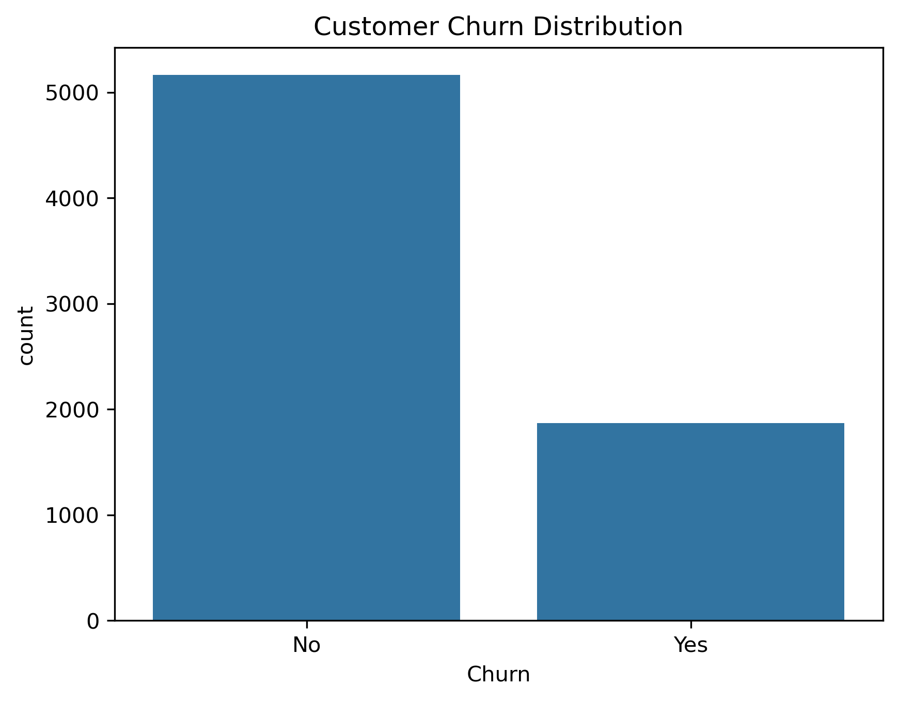
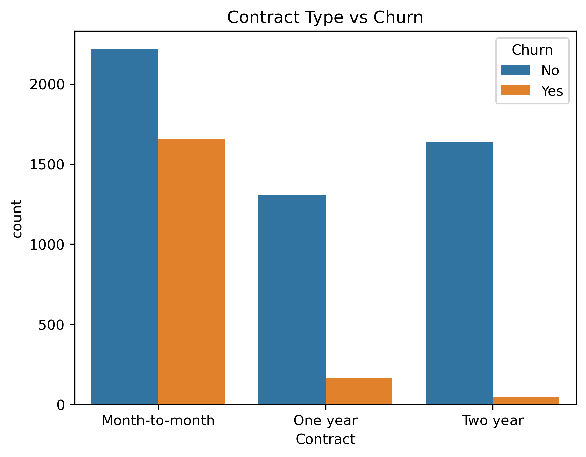
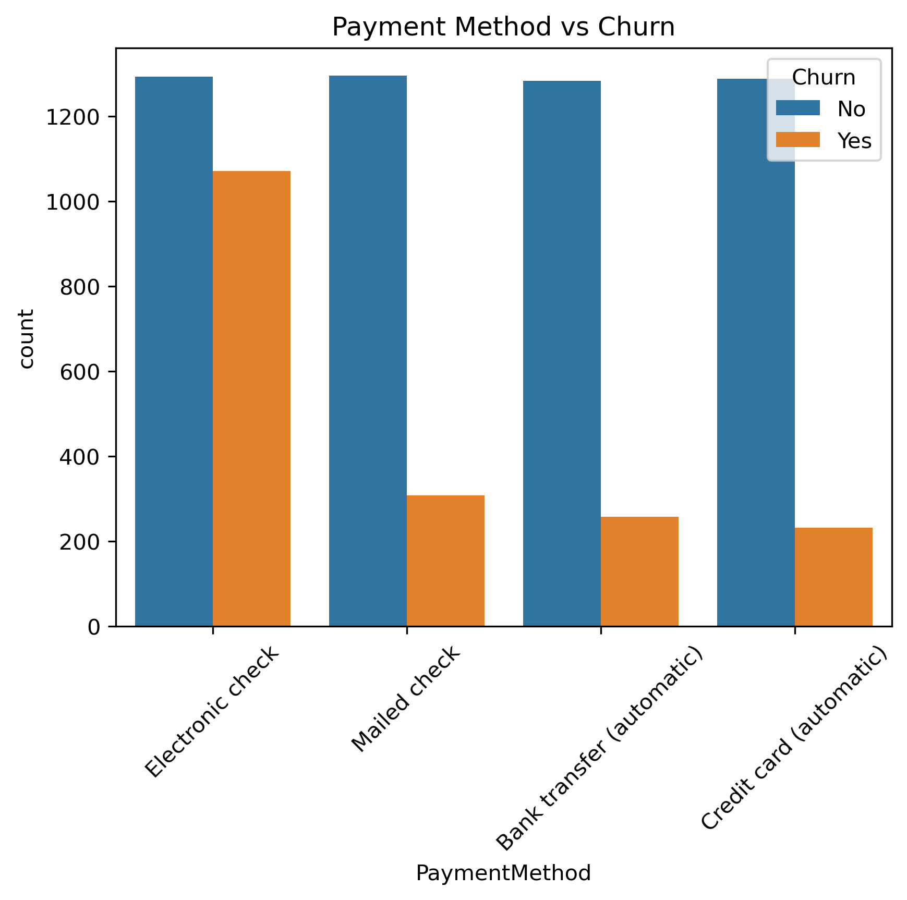
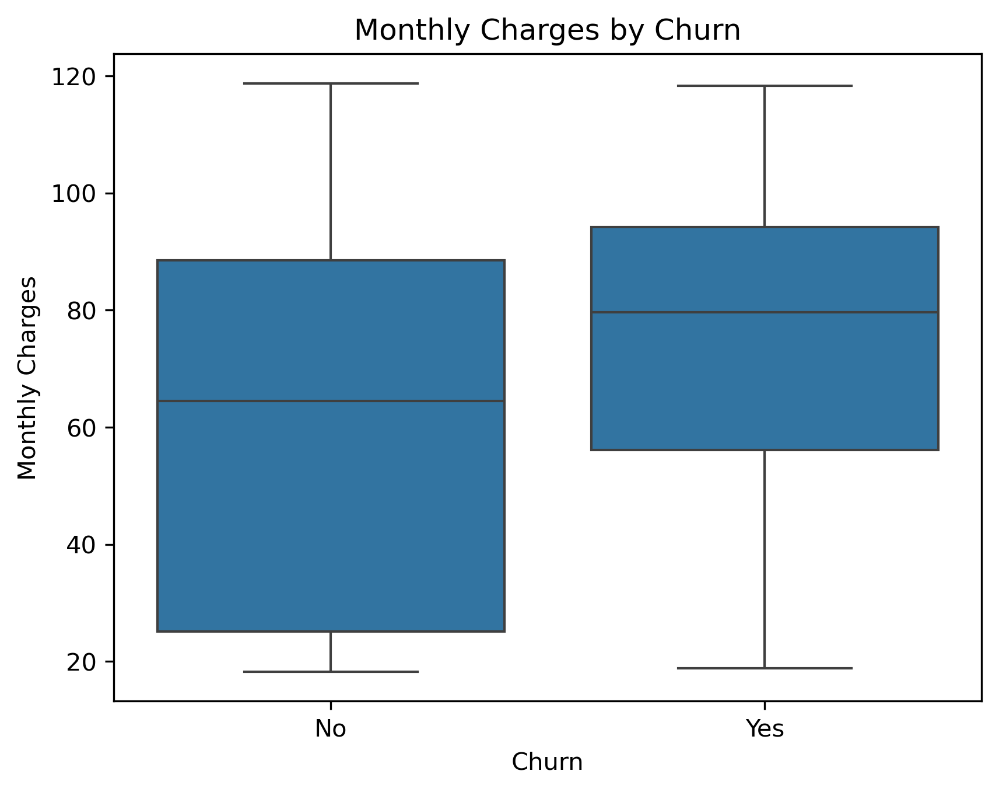
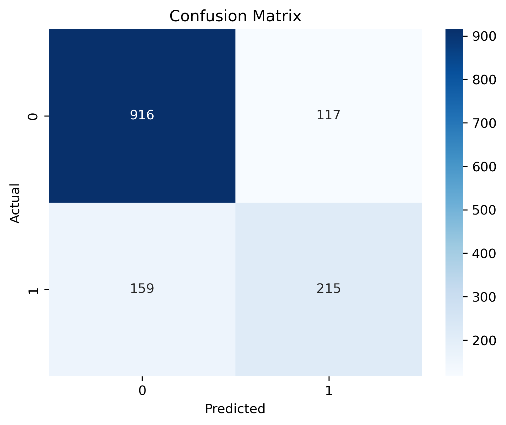
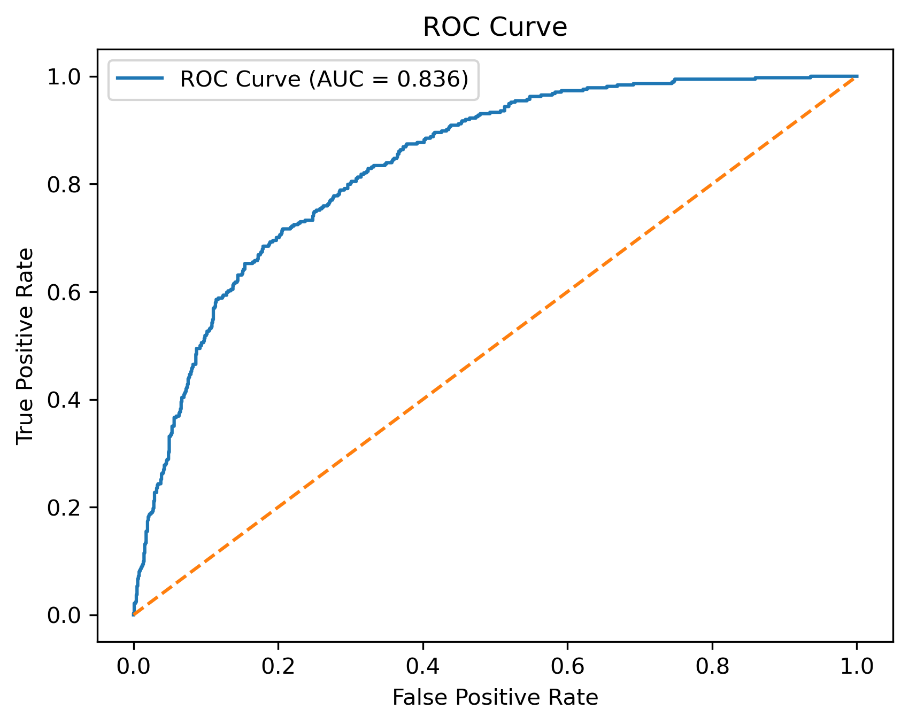

# 📊 Customer Churn Prediction using Logistic Regression

## 🚀 Project Overview

Customer churn is a critical problem in the telecom industry. Retaining existing customers is significantly more cost-effective than acquiring new ones.

This project builds a **machine learning model using Logistic Regression** to predict whether a customer is likely to churn. The solution provides actionable insights to help businesses improve customer retention strategies.

---

## 🎯 Objective

* Predict customer churn using historical telecom data
* Identify key factors influencing churn
* Support data-driven decision-making for customer retention

---

## 📂 Dataset Information

* **Dataset:** Telco Customer Churn
* **Records:** 7,043 customers → cleaned to 7,032 rows 
* **Features:** 20+ variables (demographics, services, billing, etc.) 
* **Target Variable:** `Churn` (Yes/No)

---

## 🧠 Project Workflow

### 1. Data Cleaning

* Handled missing values in `TotalCharges`
* Converted data types
* Removed irrelevant column (`customerID`)
* Final dataset: **7,032 rows**

---

### 2. Exploratory Data Analysis (EDA)

* Analyzed churn distribution (≈ 26.6% churn rate) 
* Explored categorical features:

  * Contract type
  * Internet service
  * Payment method
* Analyzed numerical features:

  * Tenure
  * Monthly charges
  * Total charges

---

### 3. Feature Engineering

* Converted target variable to binary (0/1)
* Applied **One-Hot Encoding**
* Final dataset: **30+ features**

---

### 4. Model Building

* Algorithm: **Logistic Regression**
* Train-test split: 80% / 20%
* Feature scaling using StandardScaler

---

## 📊 Model Performance

| Metric        | Value      |
| ------------- | ---------- |
| Accuracy      | **80.38%** |
| ROC-AUC Score | **0.8357** |

📌 Confusion Matrix:

* True Negatives: 916
* True Positives: 215
* False Positives: 117
* False Negatives: 159 

📌 Classification Report:

* Precision (Churn): 0.65
* Recall (Churn): 0.57
* F1 Score: 0.61 

---
## 📊 Visual Insights

### 📌 Customer Churn Distribution



### 📌 Contract Type vs Churn



### 📌 Payment Method vs Churn



### 📌 Monthly Charges vs Churn



### 📌 Confusion Matrix



### 📌 ROC Curve




## 📈 Key Insights

🔹 Customers with **month-to-month contracts** have the highest churn
🔹 **Fiber optic users** show higher churn rates
🔹 **Electronic check payments** are strongly associated with churn
🔹 Customers with **short tenure** are more likely to leave
🔹 Higher **monthly charges** increase churn probability

---

## 🧮 Feature Importance (Top Drivers)

* InternetService (Fiber optic)
* TotalCharges
* MonthlyCharges
* Contract type

---

## 💼 Business Impact

This model helps companies to:

* Identify high-risk customers
* Design targeted retention campaigns
* Reduce churn rate
* Increase long-term revenue

---

## 🛠️ Tech Stack

* Python
* Pandas, NumPy
* Matplotlib, Seaborn
* Scikit-learn

---
## 📂 Project Structure

```
customer-churn-logistic-regression/
│
├── data/                          # Dataset information
│   └── README.md
│
├── images/                        # Visualizations and plots
│   ├── confusion_matrix.png
│   ├── contract_type_vs_churn.png
│   ├── customer_churn_distribution.png
│   ├── dependents_vs_churn.png
│   ├── distribution_of_monthly_charges.png
│   ├── distribution_of_tenure.png
│   ├── distribution_of_total_charges.png
│   ├── gender_vs_churn.png
│   ├── internet_service_vs_churn.png
│   ├── monthly_charges_by_churn.png
│   ├── partner_vs_churn.png
│   ├── payment_method_vs_churn.png
│   ├── roc_curve.png
│   ├── senior_citizen_vs_churn.png
│   ├── tenure_by_churn.png
│   ├── total_charges_by_churn.png
│   ├── top_10_negative_features.png
│   └── top_10_positive_features.png
│
├── customer_churn_logistic_regression.ipynb   # Main notebook
├── README.md                                 # Project documentation
├── LICENSE
└── .gitignore
```

## 🔮 Future Improvements

* Implement advanced models (Random Forest, XGBoost)
* Hyperparameter tuning
* Model deployment (Streamlit / Flask API)
* Real-time churn prediction system

---

## 👨‍💻 Author

**Mohammad Saiful Alam**
📍 Data Science | Machine Learning | SQL | Statistical Analysis

---

## ⭐ If you found this project useful, consider giving it a star!
